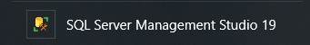
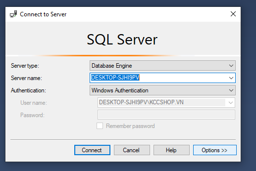
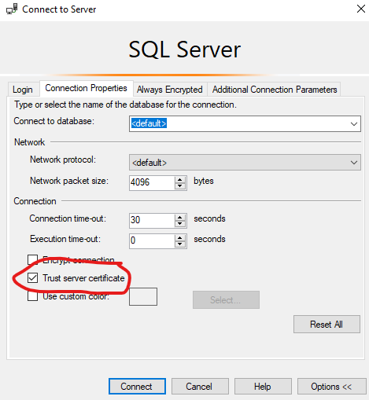
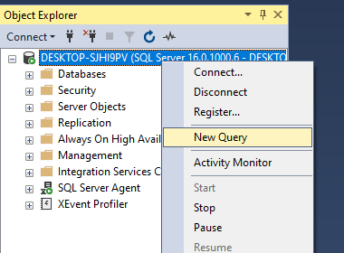
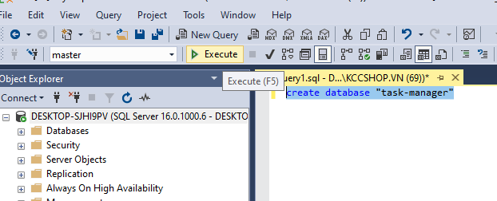
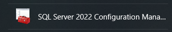
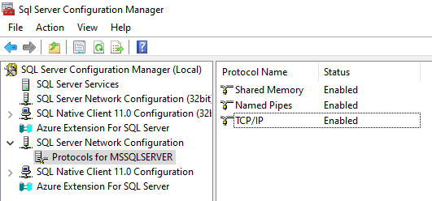
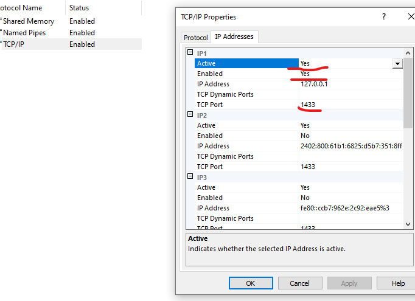
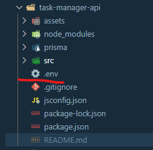

# Restful Api for Task Manager app

## hướng dẫn migrate bằng Prisma

1. Download [SQL Server Management Studio](https://learn.microsoft.com/en-us/sql/ssms/download-sql-server-management-studio-ssms?view=sql-server-ver16)

2. Cài đặt xong mở 

3. Trước khi bấm connect, chọn **Options** > **Connection Properties** > **Trust server certificate**  

> [!IMPORTANT]
> Có thể chọn authentication khác, trong này sử dụng window authentication. Chọn **Trust server certificate** để dễ nối với server nếu không thì sẽ phức tạp

4. Click chuột phải vào server vừa connect trong **Object Exploer**, chọn **New query** 

5. Gõ lệnh sql để tạo database mới

```
create database "task-manager"
```

rồi nhấn f5 hoặc chọn execute 

6. Tạm thời xong với SSMS, bây giờ mở SQL Server Configuration Manager 

7. Ở bên tay trái chọn **SQL Server Network Configuration** > **Protocol for MSSQLSERVER**, kết quả hiện bên phải 

8. Chuột phải chọn mục **TCP/IP** > **Enable**. Kiểm tra lại các property chuột phải **TCP/IP** > **Properties** > **Ip Address**, đảm bảo giống các phần được gạch chân, có thể chọn cổng khác TCP khác nếu muốn, mặc định là 1433 

9. Bên trái, chọn **SQL Server Services**, chuột phải **SQL Browser Server** > **Start** , chuột phải **SQL Server** > **Restart**

> [!WARNING]
> Bước 8,9. Nếu TCP/IP không enable thì SQL **Browser Server** không thể start .Nếu không restart **SQL Server** thì sẽ không cập nhật được thay đổi

> [!TIP]
> Để kiểm tra xem server đã được chạy trên nền tcp/ip chưa, chạy trên port nào, quay lại SSMS gõ lệnh SQL này vào phần query 4,5
>
> ```
> SELECT DISTINCT local_tcp_port
> FROM sys.dm_exec_connections
> WHERE local_tcp_port IS NOT NULL;
> ```

> ```
>
> ```

10. Quay lại project vừa clone tạo một file .env ở vị trí ngoài cùng project rồi paste dòng này vào. Nếu port của localhost ở mục 8 khác thì có thể thay đổi theo

```
DATABASE_URL="sqlserver://localhost:1433;database=task-manager;integratedSecurity=true;trustServerCertificate=true;"
```



11. Toàn bộ mô tả object sql sẽ nằm trong **prisma/schema.pisma**. Trong terminal vào đúng mục chứa project, đê download toàn bộ package cần thiết chạy

```
npm install
```

để migrate object được mô tả trong **prisma/schema.pisma** gõ lệnh :

```
npx prisma migrate dev --name init
```

nếu nó bảo gì thì cứ gõ Y(yes)

Nếu không báo lỗi thì mở SSMS lên vào **Databases** **task-manager** > **tables** kiểm tra kết quả
